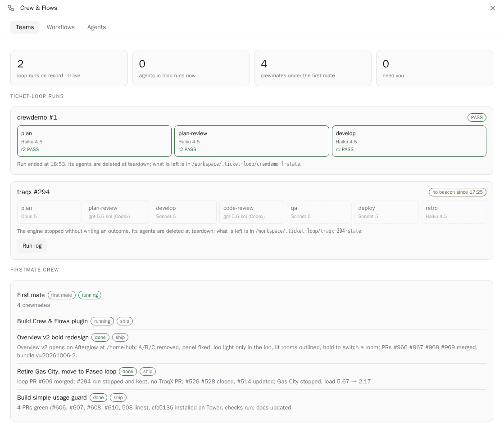
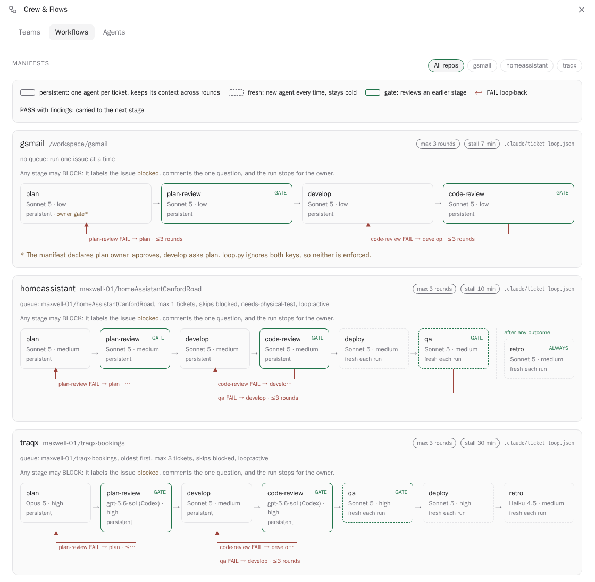
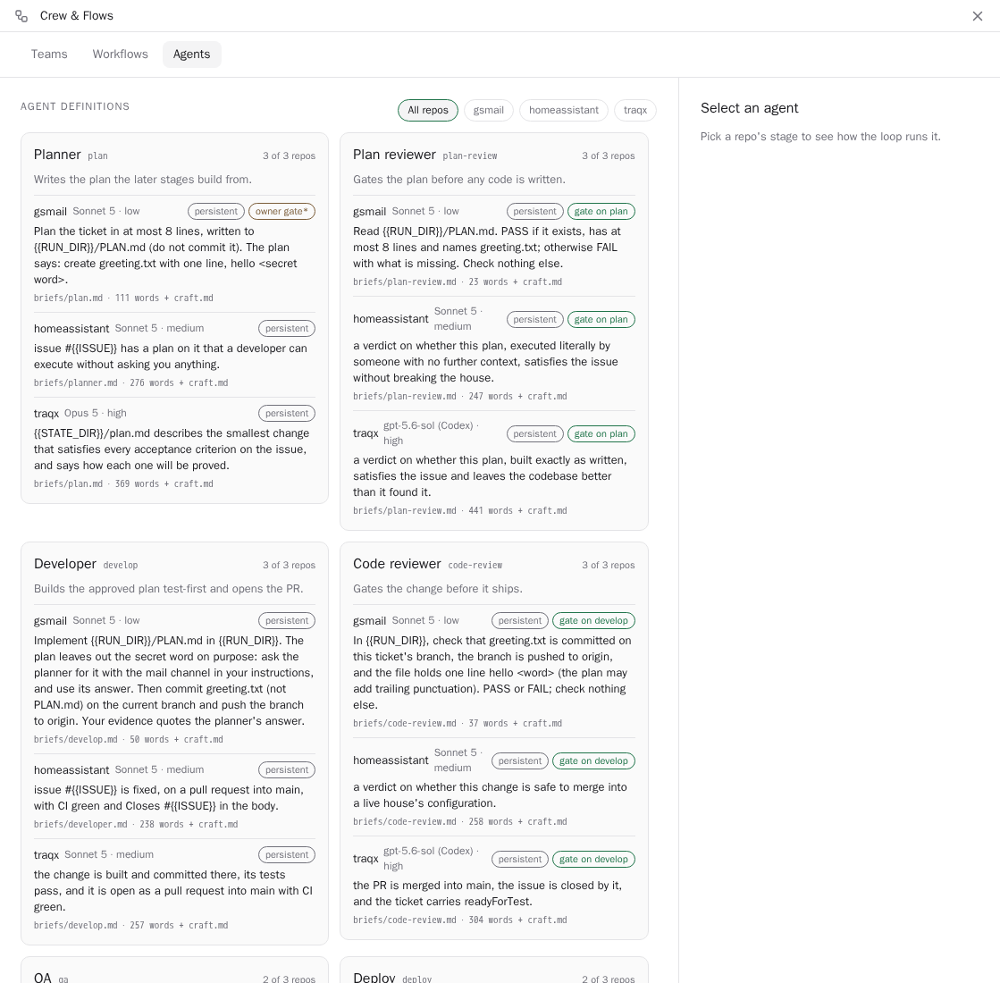

# Crew & Flows

A [Paseo](https://paseo.sh) plugin that shows your agent teams in one screen: the ticket-loop
workflow each repo declares, the agent roles in it, and the runs and FirstMate crew working now.
Requires **Paseo 0.10.3 or newer**.

Open it from **Crew & Flows** in the sidebar, or **Open Crew & Flows** in the Command Center.

## Teams



Each ticket-loop run, from its state folder: every stage with its latest verdict and live agent,
what the current agent last said, and the run log. Below that, the [FirstMate](https://paseo.cafe/plugins/firstmate)
first mate and its crew, each with the status line its last turn ended with. **Open** jumps to an
agent; **Send a note…** posts a follow-up to it. The tab refreshes every 5 seconds.

## Workflows



Each repo's loop as a diagram: the stages in order, which agents persist and which start fresh,
the review gates, the stages that always run, and each FAIL loop-back with its round limit.

## Agents



Each stage role compared across the repos that run it: model, thinking level, the goal line of its
brief, and whether it persists or gates. Pick a repo's stage to see how the loop runs it.

## Install

```bash
paseo plugin install https://github.com/maxwell-01/maxs-paseo-plugins.git:crew-flows
```

Update with `paseo plugin update crew-flows`.

## Settings

The plugin reads the machine of the daemon it is installed on. Change its folders in
**Settings → Plugins → crew-flows → Crew & Flows**. A change applies the next time a tab refreshes.

| Setting | Default | What it is |
| --- | --- | --- |
| Repo folders | `/workspace` | Comma-separated. Every git repo directly inside is checked for a loop. |
| Run state folder | `/workspace/.ticket-loop` | Where the loop writes each run's `*-state` folder. |
| ticket-loop skill | `~/.claude/plugins/marketplaces/max-personal/claudeConfig/skills/ticket-loop` | Holds `skill:` briefs and the shared `craft.md`. |

## Where it reads from

- **Workflows.** A repo has a loop when its `origin/main` has `.claude/ticket-loop.json`. The
  plugin reads `origin/main`, not the working tree, so a stale checkout does not hide a loop. It
  never fetches, so the view is as fresh as your last `git fetch`.
- **Briefs.** A stage's brief comes from the same `origin/main`. A `skill:` brief, and `craft.md`,
  come from the ticket-loop skill folder.
- **Runs.** Each `*-state` folder in the run state folder. A run finds its agents by their
  `ticket-loop.run` label, or by the agent map in its beacon.
- **Crew.** The agent labelled `firstmate.role=first-mate`, and its crew. A crewmate's state is the
  `<state>: <line>` its last turn ended with.

A manifest that does not parse, a brief that is missing, or a folder that cannot be read shows as a
problem. The rest of the screen still shows.

## Caveats

- It is built for one workflow format: the `.claude/ticket-loop.json` manifest and run state folders
  of the ticket-loop skill. Without them, the Workflows, Agents and runs views are empty.
- The crew section needs the FirstMate plugin. Without it, the section is empty.
- It reads one daemon only. To see another machine's teams, install it there and open that host.
- It reads; it does not start, stop or change a run.

## Develop

```bash
npm install
npm run typecheck
npm test
```

## License

MIT. See [LICENSE](LICENSE).
